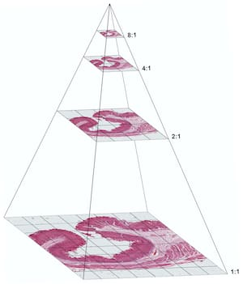

# ImageArray

**ImageArray** provides a unified, memory‑efficient way to work with pyramidal and non‑pyramidal images using the `DelayedArray` infrastructure. 
It stores large images in memory or on disk (**HDF5** or **Zarr**), exposes them through an array‑like API, and applies common image operations 
consistently across all pyramid levels

- **Pyramids:** multi‑resolution stacks of, e.g., from Zarr or OME‑TIFF images as a single object.
- **Interoperability:** plays nicely with image classes across R/Bioconductor, such as **EBImage** or **magick**. 
- **Delayed operations:** rotate/flip/flop/negate, cropping and slicing – performed lazily (without loading to memory) via `DelayedArray`.
- **Backends:** HDF5 and Zarr on‑disk storage using **HDF5Array** and **Rarr** packages.

<table>
<tr>
<td width="65%" valign="top">

## What are image pyramids?

An **image pyramid** is a multi‑scale representation built by repeatedly smoothing and down‑sampling an image (e.g. Gaussian/Laplacian pyramids). 
Pyramids make zooming, visualization, and scale‑aware analysis efficient – a staple in digital pathology and large microscopy images.

## Installation

You can install `r Biocpkg("ImageArray")` from Bioconductor with:
``` r
if (!requireNamespace("BiocManager", quietly = TRUE)) {
    install.packages("BiocManager")
}
BiocManager::install("ImageArray")
```
</td>
<td width="28%">

</td>
</tr>
</table>

## Getting started

**ImageArray** allows saving images to either HDF5 (HDF5ImageArray) or 
Zarr (ZarrImageArray) where you can define the number of layers of the 
pyramids (i.e. number of downscaled images) and the path to the on-disk h5 
or zarr store. 

```r
library(ImageArray)
library(EBImage)

img_file <- system.file("images", "sample.png", package="EBImage")
img = readImage(img_file)

dir.create(td <- tempfile())
h5_sample <- file.path(td, "sample")
imgarray <- writeImageArray(img, 
                            format = "HDF5ImageArray", 
                            output = h5_sample, 
                            nlevels = 2,
                            replace = TRUE)
```

```
ImageArray Object (x,y) 
Level 1 (768,512) 
Level 2 (384,256)
```

```r
plot(as.raster(imgarray))
```


<br>

A number of memory-efficient (delayed or lazy) operations are available 
for pyramid images, including rotation (0, 90, 180, 270), horizontal or 
vertical flipping and negation. 

```r
imgarray <- rotate(imgarray, degrees = 90)
imgarray <- flip(imgarray)
imgarray <- flop(imgarray)
imgarray  <- negate(imgarray)
imgarray
```

<br>

We can crop or slice images via lazy indexing.

```r
# crop or slice via indexing
imgarray <- imgarray[100:200, 200:300]
imgarray
```

```
ImageArray Object (x,y) 
Level 1 (101,101) 
Level 2 (51,51) 
```

<br>

You can also use an existing **OME-TIFF** (or any Bioformats image) to 
create an ImageArray object. 

```r
ome_file <- system.file("extdata", 
                        "xy_12bit__plant.ome.tiff", 
                        package = "ImageArray")
imgarray   <- createImageArray(ome_file, 
                               series = 1, 
                               resolution = 1:2)
imgarray
```

```
ImageArray Object (x,y,c) 
Level 1 (512,512,1) 
Level 2 (256,256,1) 
```